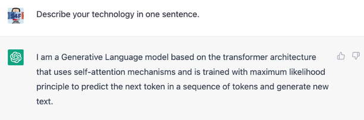

<!-- 
```{=html}

Fuer die Webseite: 
embed-resources: true
und ohne chalkboard
Für die Presentation
 #chalkboard:
    #  buttons: true
```
-->

# Language Models (Recap)

## LMM (Recap) 

Example of a LMM, ChatGPT:



## Principles of LMMs

-   Transformer Architecture / self-attention

    -   Special way of connecting neurons: @vaswaniAttentionAllYou2017

-   "trained with maximum likelihood" 

    -   "Standard training" on the complete internet

- Fintuned for specific task (e.q. coding tasks with tools)

-   Generative Language Model [...] predicts the next token in a sequence of tokens

    -   Predicts the next word (token is a word or part of a word)

::: notes
Maximum Likelihood Parameter des Models werden so eingestellt das die W'keit für beobachtete Trainingsdaten maximiert wird.
:::

## LMMs are probabistic models

-   Input a sequence of tokens $y_{1:t}$

-   Output: Probability of the next word
    $$
    p(y_{t+1} | y_{1:t})
    $$

TODO image of slides


## Generating Text (LMMs)

{fig-align="center"}

::: incremental
-   Steps 1: Describe your technology in one sentence. -\> I

-   Steps 2: Describe your technology in one sentence. I -\> am

-   Steps 3: Describe your technology in one sentence. I am -\> a

-   Steps 4: Describe your technology in one sentence. I am a -\> generative

-   ...

-   Step 36 Describe your technology in one sentence. I am a ... new text. -\> \<END\>
:::

When generating text, the next word is sampled proportionally to its probability.

## Architecture Overview

```{mermaid}
---
config:
  layout: dagre
---
flowchart RL
 subgraph Provider["Provider (OpenAI, Ollama, ...)"]
        H["Handler"]
        LLM["LLM"]
  end
    Provider -- response --> Agent["Agent"]
    Agent -- request --> Provider
    style Provider fill:transparent
    linkStyle 0 stroke:#000000,fill:none
    linkStyle 1 stroke:#424242,fill:none

```

- The Agent sends a request to the Provider (e.g. OpenAI, Ollama, ...)
- The Provider makes a String from the request, tokenizes it to $y_{t:0}$ and sends it to the LLM
- The LLM generates a response $p(y_{t+1} | y_{t:0})$
- The Provider samples from the response and sends the response to the agent

## Agentic Loop

This usually happens in a loop.  
1. The Agent sends the **system prompt** (“You are Roo, a helpful…”) and the **user prompt** (“Please add the location St. Anton…”) to the Provider.  
2. The Provider returns the response to the Agent (might request to use a tool).  
3. The Agent fulfills the request (e.g. calls a tool) and sends the result back to the Provider.

```{mermaid}
%%{init: {'flowchart': {'htmlLabels': true}, 'securityLevel': 'loose'} }%%
flowchart LR
  subgraph Agent
    A1["Build Prompt<br/>(system + user)"]
    A2["Fulfill Request<br/>(tools, reasoning)"]
  end

  subgraph Provider
    P1["LLM<br/>(prompt processing)"]
    P2["Return Response"]
  end

  A1 -->| "1. request" | P1
  P1 -->| "2. response" | A2
  A2 -->| "3. result" | P1
```


## Literature
