# AutoStan

**Autonomous Bayesian Model Improvement via Predictive Feedback**

<br>

Oliver Dürr 

<!--
Welcome, everyone. Today I want to show you something that surprised me: a coding AI agent — the kind you use every day to write Python or JavaScript — can now autonomously build and improve Bayesian statistical models. This is a story about where probability theory, MCMC, and the agentic AI revolution converge.
-->

---

# Inspiration: Karpathy's autoresearch


> A coding agent with a single scalar reward — **validation bits-per-byte** — improves a neural network training script autonomously overnight.

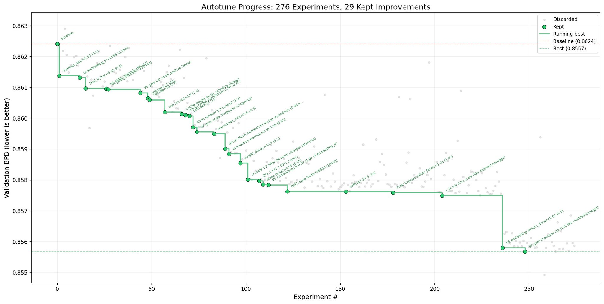

[github.com/karpathy/autoresearch](https://github.com/karpathy/autoresearch)

---

# Outline

1. **Probabilistic Modeling** - from maximum likelihood to Bayesian inference 
2. **MCMC & Stan** — the computational engine
3. **AutoStan** — letting agents do the hard work
4. **Results** — what the agent actually discovers

<!--
Four parts. A bit of background on Bayesian modeling, then MCMC, then our main contribution AutoStan, and finally results across five different datasets.
-->

---
layout: section
---

# Probabilistic Modeling

---

# The Generative Model

<div class="grid grid-cols-2 gap-8 mt-6 items-center"> <div>

**A probabilistic model specifies how data $y$ is generated:**

$$
\theta \xrightarrow{\text{model}} y
$$

  - State the **likelihood**: how does $y$ depend on $\theta$?
    - $p(y \mid \theta)$   
  - Stan program is a direct implementation of this generative process, with parameters.
```cpp
model { //y = number of red balls in 4 draws
  y ~ binomial(theta, N=4);
}
```
</div>

  <div>
      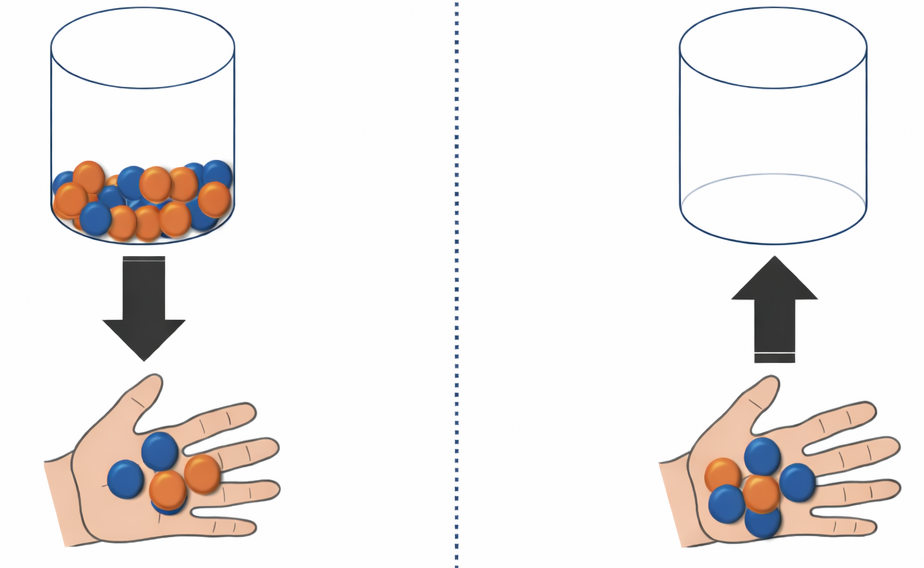
  </div>
</div>


MLE: find the $\theta$ that makes observed data most probable. 
$$
  \hat\theta_\mathrm{MLE} = \arg\max_\theta p(y \mid \theta)
$$

<!--
Before we do regression: think of a Stan model as a recipe for generating data. You specify parameters, the model produces simulated observations. MLE asks: which parameters produced *this* data with the highest probability?
-->

---
layout: two-cols-header
---

# Linear Regression (MLE)

Regression: $y \rightarrow y|x$

::left::
**The probabilistic model:**

$$y_i \sim \mathcal{N}(\mu_i,\; \sigma), \qquad \mu_i = \beta_0 + \beta_1\, x_i$$

<br>

**Parameters:**
- $\beta_0$ — intercept
- $\beta_1$ — slope
- $\sigma$ — observation noise

<br>

We estimate $\beta_0, \beta_1, \sigma$ that best explain the data.

$$
\hat\theta_\mathrm{MLE} = \argmax_{\beta_0, \beta_1, \sigma} p(y \mid x, \beta_0, \beta_1, \sigma)
$$

::right::

**The Stan program:**

```cpp
data {
  int<lower=0> N;
  vector[N] x;
  vector[N] y;
}
parameters {
  real beta_0;
  real beta_1;
  real<lower=0> sigma;
}
model {
  y ~ normal(beta_0 + beta_1 * x, sigma);
}
```

<!--
Let's start simple: linear regression. On the left, the mathematical model — y is normally distributed with mean that's a linear function of x. On the right, the exact same model written in Stan. Notice how close the code is to the math. Stan is a probabilistic programming language that lets you write models almost in mathematical notation.
-->

---
layout: two-cols-header
---

# Linear Regression — MLE Fit

::left::

**The Stan program:**

```cpp
data {
  int<lower=0> N;
  vector[N] x;
  vector[N] y;
}
parameters {
  real beta_0;
  real beta_1;
  real<lower=0> sigma;
}
model {
  y ~ normal(beta_0 + beta_1 * x, sigma);
}
```

$$
\begin{aligned}
(\hat\beta_0, \hat\beta_1, \hat\sigma) &= \argmax_{\beta_0, \beta_1, \sigma} \prod_{i=1}^N p(y_i \mid \beta_0 + \beta_1 x_i, \sigma) \\
&= \argmin_{\beta_0, \beta_1, \sigma} -\frac{1}{N}\sum_{i=1}^N \log p(y_i \mid \beta_0 + \beta_1 x_i, \sigma)
\end{aligned}
$$

::right::

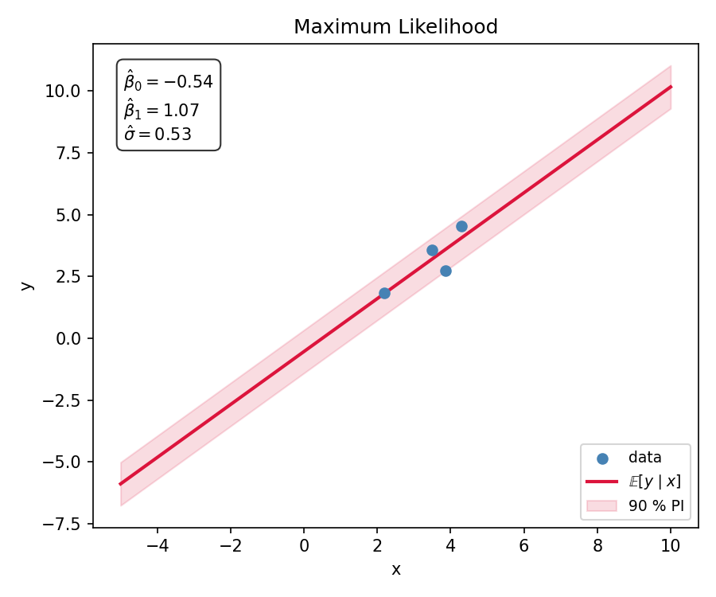

<div class="text-sm text-gray-500 mt-3 text-center italic">
Constant uncertainty — even far from data. <br/>
Traditional statistics → Confidence intervals.
</div>

---
layout: two-cols-header
---

# The Bayesian Way

::left::

**Bayes' theorem** 

Data $y$ and *parameters* $\theta$ are random variables. 

Posterior:
$$p(\theta \mid y) = \frac{p(y \mid \theta)\, p(\theta)}{p(y)}
\propto p(y \mid \theta)\, p(\theta)$$

$p(\theta)$ — prior beliefs about parameters before seeing data

- Stan program must include priors
- Sampling from posterior $\theta \sim p(\theta \mid y)$ using MCMC. 


::right::

| **You: Lik. and priors** | **Get Samples with MCMC** |
|---|---|
| $p(y \mid \theta)$, $p(\theta)$ |  $\theta \sim p(\theta \mid y)$ |


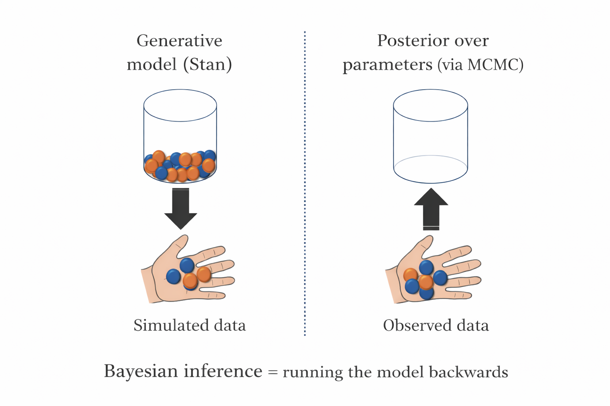


<!--
The key insight: Stan lets you write the generative model (left arrow), and MCMC runs it backwards (right arrow). You describe how data could be generated; inference recovers which parameters best explain what you actually observed.
-->


---
layout: two-cols-header
---

# MLE vs Bayes with Stan

::left::

````md magic-move
```cpp
// MLE — no priors
data {
  int<lower=0> N;
  vector[N] x;
  vector[N] y;
}
parameters {
  real beta_0;
  real beta_1;
  real<lower=0> sigma;
}
model {
  y ~ normal(beta_0 + beta_1 * x, sigma);
}
```

```cpp
// Bayes — add priors
data {
  int<lower=0> N;
  vector[N] x;
  vector[N] y;
}
parameters {
  real beta_0;
  real beta_1;
  real<lower=0> sigma;
}
model {
  // 1. Priors
  beta_0 ~ normal(0, 10);
  beta_1 ~ normal(0, 10);
  sigma  ~ normal(0, 1);    // HalfNormal

  // 2. Likelihood — condition on data
  y ~ normal(beta_0 + beta_1 * x, sigma);
}
```
````

::right::

<div v-click>

**Bayes with MCMC:**

- The parameters are now **random variables** and we have specified **priors** over them.
- The MCMC gives samples ($\beta_0^{(s)}, \beta_1^{(s)}, \sigma^{(s)}$) from the **posterior distribution** 
- With the samples ($\beta_0^{(s)}, \beta_1^{(s)}, \sigma^{(s)}$) we can compute sample $y|x$ by drawing from a Gaussian.


- **Demo Time**
</div>

<!-- In that demo, it's quite possible that posterior predictives do not correspond to the posterior samples -->


---
layout: iframe
url: https://oduerr.github.io/stat_demos/bayes_lr/
---

---
layout: default
---

# The Predictive Distribution (MLE vs. Bayes)

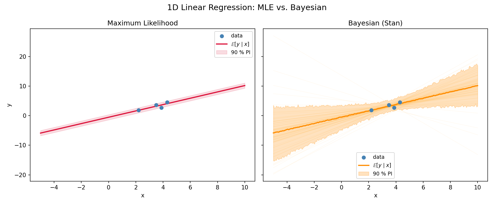


<!--
Side-by-side: MLE on the left, Bayesian predictive on the right. The key difference is visible away from the data — the Bayesian band widens because fewer data points constrain the fit there. This is honest uncertainty quantification.
-->


<!--
Live demo: step through posterior samples and watch how each draw corresponds to a regression line. The colour shows the log-likelihood — high-likelihood samples sit in the bright region of the contour plot.
-->

---
layout: two-cols-header
--- 

# Bayesian Modeling is / has been hard

The promise is beautiful. 

::left::
**The era before MCMC:**
- Closed-form conjugate models only
- Mean-field variational approximations
- Hand-derived analytical updates
- **Very limiting**

::right::
**Markov Chain Monte Carlo** draws samples $\theta^{(1)}, \ldots, \theta^{(S)}$ from the posterior.
<center>
<div class="grid grid-cols-3 gap-6 mt-8 text-center">
  <div class="p-6 rounded-lg bg-blue-50">
    <div class="text-4xl">📝</div>
    <div class="font-bold mt-3 text-lg">Stan Program</div>
    <div class="text-sm mt-1 text-gray-600">model.stan</div>
  </div>
  <div class="p-6 rounded-lg bg-green-50">
    <div class="text-4xl">📊</div>
    <div class="font-bold mt-3 text-lg">Data</div>
    <div class="text-sm mt-1 text-gray-600">train.csv</div>
  </div>
  <div class="p-6 rounded-lg bg-purple-50">
    <div class="text-4xl">🎲</div>
    <div class="font-bold mt-3 text-lg">Posterior Samples</div>
    <div class="text-sm mt-1 text-gray-600">θ⁽¹⁾, …, θ⁽ˢ⁾</div>
  </div>
</div>
</center>
<!--
MCMC was the revolution. Instead of computing the posterior analytically, we draw samples from it using a clever Markov chain. HMC and NUTS made this efficient in high dimensions. Stan puts this behind a clean modeling language with automatic differentiation.
-->

---
layout: two-cols-header
---

# Reality bites: MCMC is powerful but fragile.

| Problem | Diagnostic | Fix |
|---------|-----------|-----|
| Poor posterior geometry (funnels) | Divergences | Non-centered parameterization |
| Chains not mixing | High R-hat (> 1.01) | Better parameterization |
| ... | ... | ... |

::left::
 
::right::
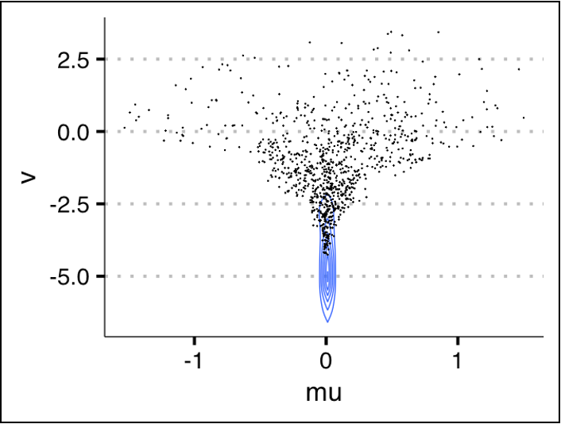


<!--
MCMC is powerful but requires expertise. Divergences tell you the sampler has trouble with the geometry of the posterior. R-hat signals non-convergence between chains. Each problem has a fix, but knowing what's wrong requires statistical knowledge. This expert babysitting is what we want to automate.
-->


---

# Comparing Models

**Negative Log Predictive Density** on held-out test data:

$$\mathrm{NLPD} = -\frac{1}{N_\mathrm{test}} \sum_{n=1}^{N_\mathrm{test}} \log \!\left( \frac{1}{S} \sum_{s=1}^{S} p\!\left(y_n^\mathrm{test} \mid \theta^{(s)}\right) \right)$$


- **Lower is better** — perfect prediction → NLPD minimal
- **Strictly proper** — uniquely minimized by the true predictive distribution
- **Model-agnostic** — works for any likelihood family (even non-Bayes)

> Data scientists use NLPD and MCMC diagnostics and a lot of intuition to iteratively improve the model.

<!--
NLPD is our key metric. The sum over S posterior samples in the inner bracket is the Monte Carlo approximation to the posterior predictive integral from the previous slide. It rewards calibration — a model that is overconfident or underconfident is penalized. And because it's computed on held-out data, it's honest.
-->

---
layout: section
---

# The New Twist: Agents

*What if a CLI coding agent could do all this automatically?*

<!--
This is where our work begins. CLI coding agents — the kind you use every day for writing code — can read files, execute shell commands, reason about their output, and iterate. What if we pointed one at a Stan modeling problem?
-->

---

# CLI Coding Agents

Terminal-based AI assistants that operate in a **read → edit → execute → observe** loop:


- **Claude Code** (Anthropic) — used in all our experiments
- **Gemini CLI** (Google) — fast, open
- **Codex CLI** (OpenAI)
- **opencode** — open-source alternative

<br>

**What they can do (Basically an AI operating the shell):**
- Read and write files
- Execute shell commands and see output
- Reason about errors and results
- Loop autonomously until a goal is met


<!--
These agents aren't just chatbots — they're fully autonomous tools that can run arbitrary shell commands, edit files, and observe the output. They're designed for programming tasks. The insight: Stan modeling IS a programming task.
-->

---

# CLI Coding Agents (demo)
If time permits

---
layout: two-cols-header
---

# The AutoStan Loop
::left::
```
┌──────────────────────────────────────────────────────────────────┐
│  program.md (56-line instructions)   dataset.md (data desc.)     │
└─────────────────┬──────────────────────────┬─────────────────────┘
                  │                          │
                  ▼                          ▼
           ┌──────────────── CLI Agent ───────────────────┐
           │                                              │
           │  1. read history (results/log.jsonl)         │
           │  2. propose change                           │
           │  3. edit model.stan                          │
           │         │                                    │
           │         ▼                                    │
           │  4. python evaluate.py --notes "..." \       │
           │                        --rationale "..."     │
           │         │                                    │
           │         ▼                                    │
           │  NLPD + divergences + R-hat + ESS            │
           │         │                                    │
           │  5. keep if better, revert if worse          │
           │         │                                    │
           └────────-┴repeat (stop: 3 non-imp or 20 it) ──┘
```
::right::
```bash
# Claude Code
claude "Read program.md for your instructions. \
        Your dataset is datasets/regression_1d_large."
```
<!--
Here's the loop. The agent reads two files for context, then enters an autonomous loop: edit model.stan, run evaluate.py, see NLPD and MCMC diagnostics, keep or revert. The filesystem is its memory — all history is in results/log.jsonl. Stop after 3 consecutive non-improving iterations or 20 total.
-->

---
layout: two-cols
---

# program.md

*(56 lines — the only domain-agnostic instructions)*

```markdown
You are an autonomous Bayesian modeling agent.
Your task: minimize NLPD on held-out test data.

## Workflow
1. Read dataset description
2. Check history (previous iterations)
3. Inspect train.csv
4. Edit model.stan
5. Run evaluate.py
6. Keep or revert
7. Repeat

## Strategies to Consider
- Non-centered parameterization
- Prior tightening / loosening
- Different likelihoods (Normal, Student-t, ...)
- Hierarchy levels
- Covariate effects, interactions

## Stopping Rule
Stop after 3 consecutive non-improving
iterations or 20 total.
```

::right::

# dataset.md

*(short, dataset-specific)*

```markdown
# Dataset: 1D Regression

Observations of a continuous predictor
and a continuous response.

## Data Format
train.csv columns:
- `predictor`: continuous input
- `response`: continuous output

## Stan Data Interface
N_train, N_test,
predictor_train[N_train],
predictor_test[N_test],
response_train[N_train],
response_test[N_test]

## Evaluation
python datasets/regression_1d_large/
       protected/evaluate.py \
       --notes "what changed" \
       --rationale "why"
```

<!--
These are the two files the agent reads. program.md is completely domain-agnostic — the same file is used for all five datasets. dataset.md is short and dataset-specific, containing only column names, data format, and how to run evaluation. Variable names are anonymized. No hints about the true model structure.
-->

---
layout: section
---

# Case Study: 1D Regression with Outliers

*Can the agent discover robust nonlinear heteroscedastic structure on its own?*

---

# The Dataset — What the Agent Sees

<div class="grid grid-cols-2 gap-8 mt-4 items-center">
<div>

**1D regression benchmark:**

- $N = 500$ training points
- Non-linear true mean: $f(x) = 2\sin(1.2x) + 0.3x$
- Heteroscedastic noise: $\sigma(x)$ varies with $x$
- Hidden test set used only for NLPD evaluation
- Test set no outliers

**The agent never sees the true $f(x)$ or $\sigma(x)$.**  
It only sees `train.csv` and the NLPD score.

</div>
<div>
  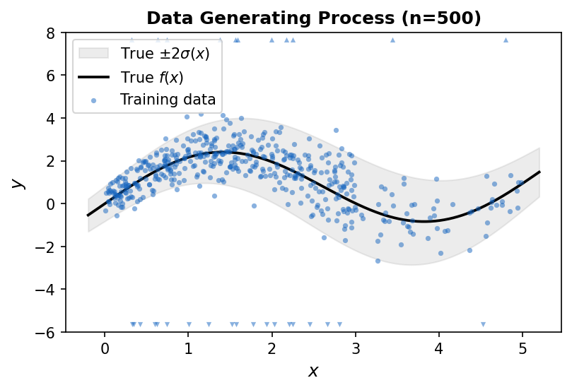
</div>
</div>

<!--
Here is the dataset the agent will work with. One hundred training points drawn from a non-linear, heteroscedastic process. The true function and noise are shown here for us, but the agent only sees the raw CSV and the NLPD score it gets back after fitting. Its job: find a Stan model that predicts well on the hidden test set.
-->

---

# NLPD Trajectory: 15 Iterations

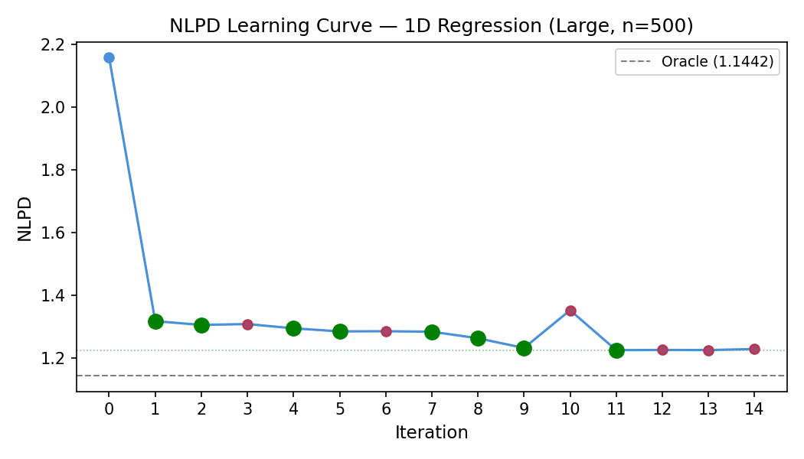


- **Iter 0** — NLPD = 2.16: linear Gaussian, dominated by outliers
- **Iter 1** — NLPD = 1.32: biggest jump (−0.84): Student-*t* + polynomial mean
- **Iters 2–8** — NLPD 1.30 → 1.28: sinusoidal basis, heteroscedastic variance
- **Iter 9** — NLPD = 1.23: contamination mixture
- **Iter 11 (best)** — NLPD = **1.226** · Oracle = 1.144


<!--
Here's the NLPD over 15 iterations. The baseline linear Gaussian model is terrible — outliers dominate everything. In a single step, Student-t robustness cuts NLPD almost in half. Then the agent gradually refines structure: sinusoidal mean, heteroscedastic variance, contamination mixture.
-->

---

# Model Evolution: Stan Code

````md magic-move
```cpp
// Iteration 0: Baseline — linear Gaussian (NLPD 2.16)
model {
  alpha ~ normal(0, 5);
  beta  ~ normal(0, 5);
  sigma ~ normal(0, 5);

  response_train ~ normal(alpha + beta * predictor_train, sigma);
}
```

```cpp
// Iteration 1: Cubic polynomial + Student-t  (NLPD 2.16 → 1.32, Δ = −0.84)
model {
  nu ~ gamma(2, 0.1);  // degrees of freedom — heavy tails

  vector[N_train] mu = alpha + beta1 * predictor_train
                       + beta2 * (predictor_train .* predictor_train)
                       + beta3 * (predictor_train .* predictor_train .* predictor_train);

  response_train ~ student_t(nu, mu, sigma);
}
```

```cpp
// Iterations 4–8: Sinusoidal mean + heteroscedastic log-variance
model {
  real omega = pi() / 3.0;  // fixed frequency

  vector[N_train] mu = alpha
    + a1 * sin(omega * predictor_train)
    + b1 * cos(omega * predictor_train)
    + beta_lin * predictor_train;

  vector[N_train] sigma_train = exp(s0 + s1 * predictor_train
                                    + s2 * (predictor_train .* predictor_train));

  for (n in 1:N_train)
    response_train[n] ~ student_t(nu, mu[n], sigma_train[n]);
}
```

```cpp
// Iteration 11 (best): Contamination mixture  (NLPD 1.23 → 1.226)
model {
  // learnable frequency: omega ~ normal(pi()/3, 0.3)
  vector[N_train] mu = alpha
    + a1 * sin(omega * predictor_train)
    + b1 * cos(omega * predictor_train)
    + beta_lin * predictor_train;

  vector[N_train] sigma_train = exp(s0 + s1 * predictor_train
    + s2 * x2 + s3 * x3);  // cubic log-variance

  for (n in 1:N_train)
    target += log_mix(pi_out,
      normal_lpdf(response_train[n] | mu[n], sigma_out),   // outlier (σ=10)
      normal_lpdf(response_train[n] | mu[n], sigma_train[n]));  // inlier
}
```
````

<!--
Click through to see the model evolve. Step 1: linear Gaussian with normal priors. Step 2: one change — Student-t + cubic polynomial mean — drops NLPD by 0.84, the biggest jump of the entire run. Step 3: sinusoidal basis with fixed frequency ω=π/3, plus heteroscedastic log-quadratic sigma, likelihood stays Student-t per point. Step 4: contamination mixture — both components are Normal (wide outlier σ=10, narrow inlier σ(x)), learnable omega, cubic log-variance. The agent fixed the label-switching pathology by fixing σ_out=10.
-->

---

# The Full Picture

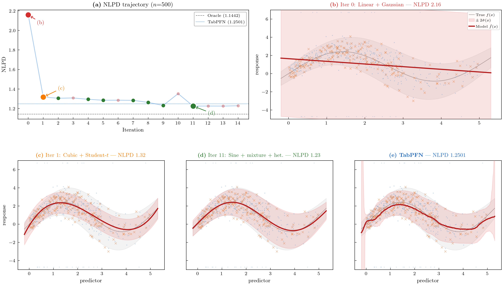

Autostan beats TabPFN on NLPD and, more importantly, is interpretable. 

<!--
Here's the full visualization. Panel (a): NLPD trajectory. Panels (b)–(d): posterior predictive at three stages — baseline, iteration 1, and best. The faint grey overlay is the oracle. Panel (e) is TabPFN. Notice: by iteration 11, AutoStan closely tracks the true noise envelope. TabPFN has uniformly too-wide intervals because its predictive distribution absorbed the training outliers.
-->

---

# Tokencounts (smaller run)

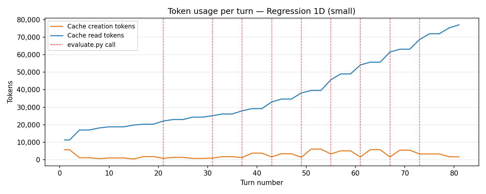

- This is a run with fewer MCMC steps and less data (wall time approx 10 minutes)
- Total number of tokens read ~ 2 Mio 
  - In several turns (53 calls to LLM) starting with 11'000 tokens

---

# Tokencounts (Large run)

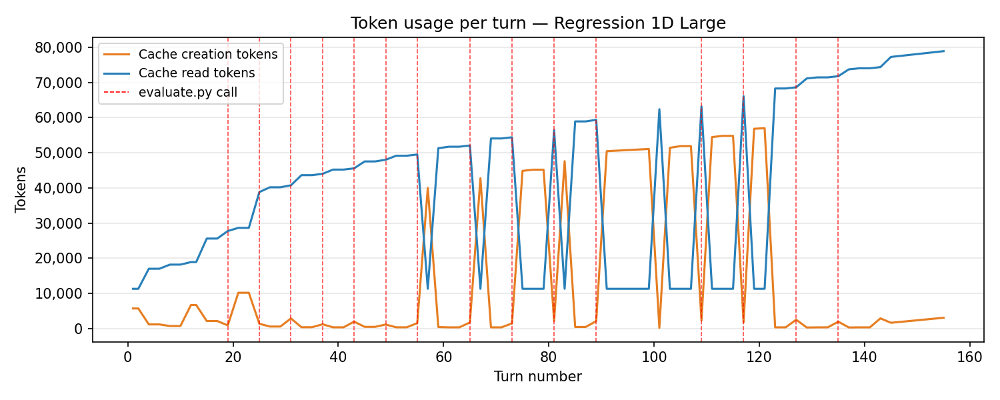

- This is a run with 30k MCMC steps and much more data (wall time approx 3.5 hours)
- Technical problem due to cache invalidation, which is caused by MCMC sampling taking more than 5 minutes (cache invalidation after 5 minutes). 


---

# Football: Bundesliga 2024/25

Real data — 18 Bundesliga teams, temporal train/test split.


**The agent immediately wrote a canonical Poisson attack/defense model:**

```cpp
model {
  goals_home ~ poisson_log(mu_home);
  goals_away ~ poisson_log(mu_away);
  // mu_home = attack[home_id] - defense[away_id] + home_adv[home_id]
  // mu_away = attack[away_id] - defense[home_id]
}
```

**Iterative improvements:**
1. Hierarchical priors on attack/defense parameters ($\Delta = -0.020$)
2. Non-centered parameterization (NCP) — fixes funnel geometry
3. Team-specific home advantage ($\Delta = -0.003$)

**Rejected** as non-improvements:
- Negative binomial likelihood, Dixon–Coles low-scoring correction and Bradley–Terry quality parameter

<!--
For Bundesliga data with domain-labeled columns like home_team_id and home_goals, the agent immediately recognized the structure and wrote the canonical sports statistics model. Key finding: it also correctly rejected several common extensions — negative binomial, Dixon-Coles — because they didn't improve NLPD.
-->

---

# Bundesliga: Interpretable Posteriors

<div class="grid grid-cols-2 gap-4">
  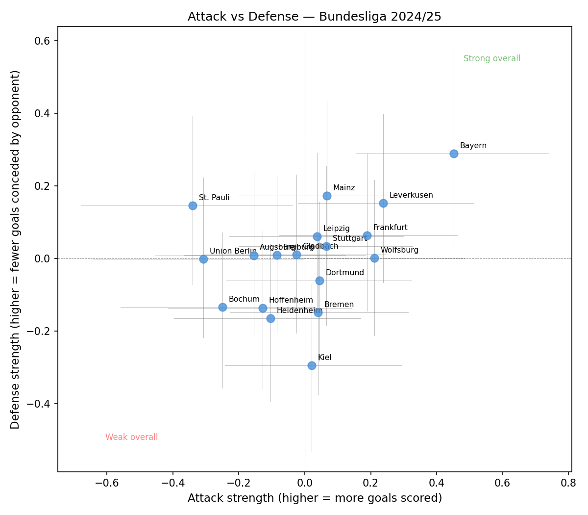
  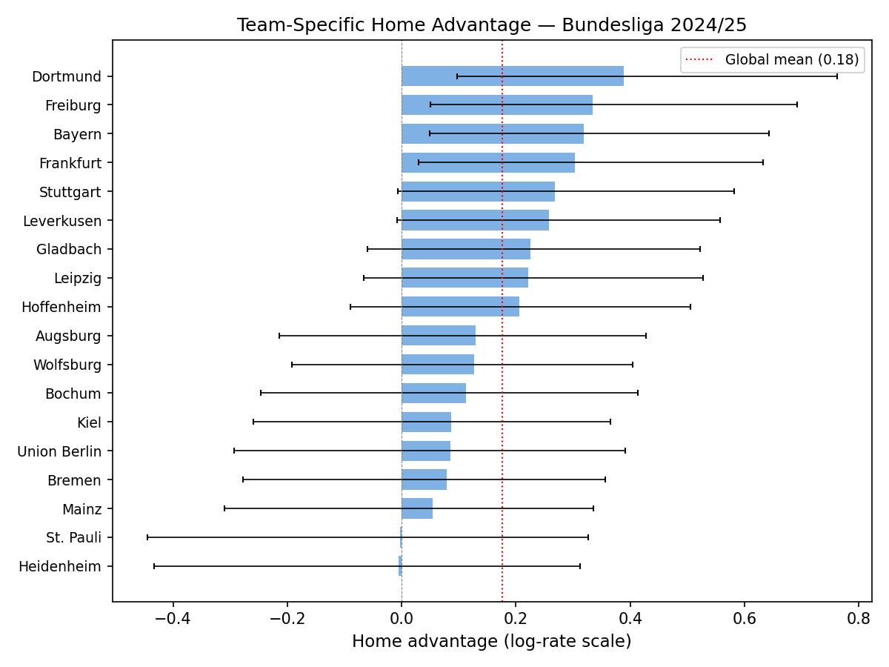
</div>


**Fully interpretable outputs:** posterior distributions with uncertainty over attack/defense strengths and home advantage for all 18 teams — not just point estimates.


<!--
And the output is not just a number — it's a full probabilistic model. We get posterior distributions over attack and defense strengths for all 18 teams, with uncertainty estimates, and team-specific home advantage. You can use these to make probabilistic predictions for future matches.
-->

---

# All Five Datasets

| | Hier. S | Hier. L | Slopes | 1D Small | **1D Large** | Bundesliga |
|---|:---:|:---:|:---:|:---:|:---:|:---:|
| Oracle | 1.494 | 1.404 | 1.263 | 0.944† | 1.144† | — |
| Baseline | 1.500 | 1.404 | 1.818 | 2.248 | 2.159 | 1.566 |
| **Best** | **1.500** | **1.401** | **1.274** | **1.124** | **1.226** | **1.543** |
| Iters | 0 | 4 | 10 | 5 | 11 | 9 |


**Diverse modeling structures discovered autonomously:**
- **Hierarchical small**: correct model at iteration 0 — group structure recognized instantly
- **Hierarchical large**: NCP + group-specific variances + Student-*t* + data-informed priors
- **Varying slopes**: correlated random intercepts and slopes with partial pooling
- **Bundesliga**: Poisson attack/defense with hierarchical priors and NCP


<!--
Across all five datasets the agent finds good models without any dataset-specific instructions. The hierarchical small result is remarkable: NLPD 1.500 vs oracle 1.494 — already near-optimal at iteration 0, no improvement needed. The agent recognized the group structure and immediately wrote the right model.
-->

---
layout: default
---

# Discussion

<!-- 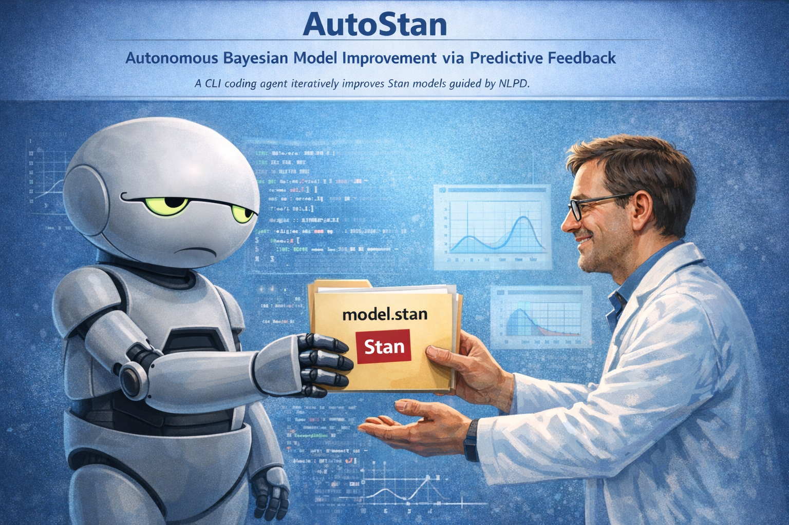 -->
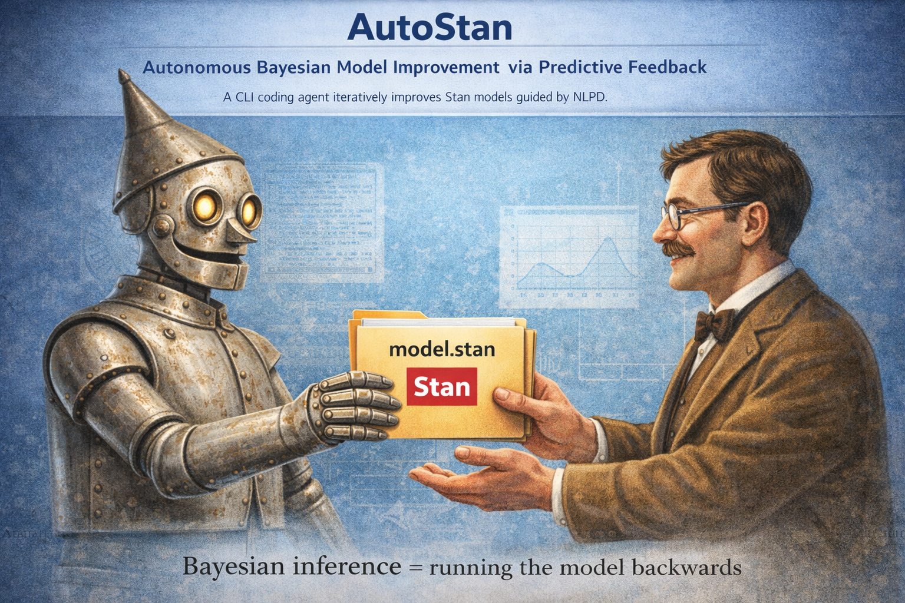


- **Next Steps?** 
- Currently on the order of 50 turns with 10k - 80k tokens per turn resulting in $\approx$ 2 Mio cached tokens. About 11k is baseline (CLI-Tools)
- Discussion on Stan Usergroup


---
layout: section 
---

# Attic

---

# Four Key Findings


**1. NLPD + diagnostics drive structural discovery**  
NLPD rewards better predictions. Divergences + R-hat + ESS signal *how* the model is broken.  
→ The agent reads *both* channels. Both are essential.

**2. The agent adapts to data structure and scale**  
Small data: gets robust fast. Large data: additional structure identified (frequency, cubic variance profile).  
68 obs → Student-*t*. 500 obs → also sinusoidal frequency and cubic heteroscedastic profile.

**3. The agent adapts to domain**  
Anonymized columns → generic baselines.  
Domain-labeled columns (Bundesliga) → domain-appropriate model immediately.  
Even with anonymized columns: paired integer counts recognized as sports matchup.

**4. The agent knows when to stop**  
Divergences, elevated R-hat, and NLPD increase reliably reject overcomplex models.  
3-segment piecewise (15 divergences), learned knots (282 divergences, R-hat = 1.63): both correctly rejected.


<!--
Four findings. The most important: NLPD and MCMC diagnostics together provide the complete feedback loop. No critic, no search algorithm, no supervision. The agent's domain knowledge from its training data is an asset — even anonymous integer count pairs get recognized as sports-style matchups.
-->

---

# Limitations


**Test-set overfitting**  
Iterating against the same held-out set risks mild overfitting.  
Hierarchical-large best model slightly beats oracle (1.401 vs. 1.404).  
→ Mitigation: cross-validation, test-set rotation, or **PSIS-LOO** (computed directly from the `log_lik` vector, no test set needed).

**Contamination bias**  
Using training data to set prior scale (e.g., outlier magnitude from training) technically conflates prior and likelihood.  
→ Acceptable for prediction goals. For genuine inference: replace with your actual prior beliefs before the final run.

**Memorization vs. reasoning**  
The agent's training data may contain similar textbook problems.  
→ Mitigated by anonymized variable names and unpublished generative processes.

**Compute cost**  
Each iteration: compile + 4 chains × 1000 MCMC draws. Large 1D: 30,000 draws to reduce Monte Carlo noise.  
→ ~5–15 min per iteration on a modern laptop.


<!--
Honest limitations. The biggest structural concern is mild test-set overfitting from iterating against the same test set. PSIS-LOO is a principled within-sample alternative that needs no held-out set. Memorization is the hardest to rule out but anonymization strongly mitigates it.
-->

---
layout: center
---

# Conclusion

## NLPD and MCMC diagnostics are all you need.

<br>


A CLI coding agent, guided only by NLPD + sampler diagnostics, autonomously discovers:
- **Robust likelihoods** — Student-*t*, contamination mixtures
- **Nonlinear heteroscedastic structure** — sinusoidal mean, log-linear variance
- **Hierarchical partial pooling** — partial pooling, NCP, correlated slopes
- **Domain-appropriate models** — Poisson attack/defense for sports

**Without:** search algorithms, critic modules, dataset-specific instructions, or human supervision.

**Output:** fully interpretable, readable Stan code — not a black box.


<br>


📄 Paper, code & datasets: [github.com/tidit-ch/autostan](https://github.com/tidit-ch/autostan)  
🛠 Practical skill for your own data: [github.com/tidit-ch/autostan-skill](https://github.com/tidit-ch/autostan-skill)


<!--
To conclude: AutoStan shows that CLI coding agents can navigate the full Bayesian modeling workflow, from a naive baseline to a sophisticated model with outlier handling, nonlinear structure, and heteroscedastic variance. The only ingredients: a 56-line instruction file, a short dataset description, and NLPD. No algorithm, no critic, no supervision.
-->

---
layout: center
class: text-center
---

# Thank You

**Questions?**

<br>

Oliver Dürr  
`oliver.duerr@tidit.ch`

<br>

[github.com/tidit-ch/autostan](https://github.com/tidit-ch/autostan) &nbsp;·&nbsp; [github.com/tidit-ch/autostan-skill](https://github.com/tidit-ch/autostan-skill)

<!--
Thank you! Happy to take questions.
-->
