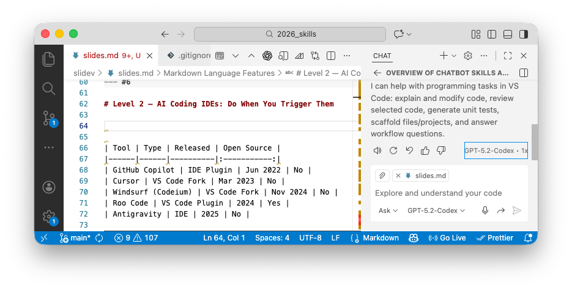
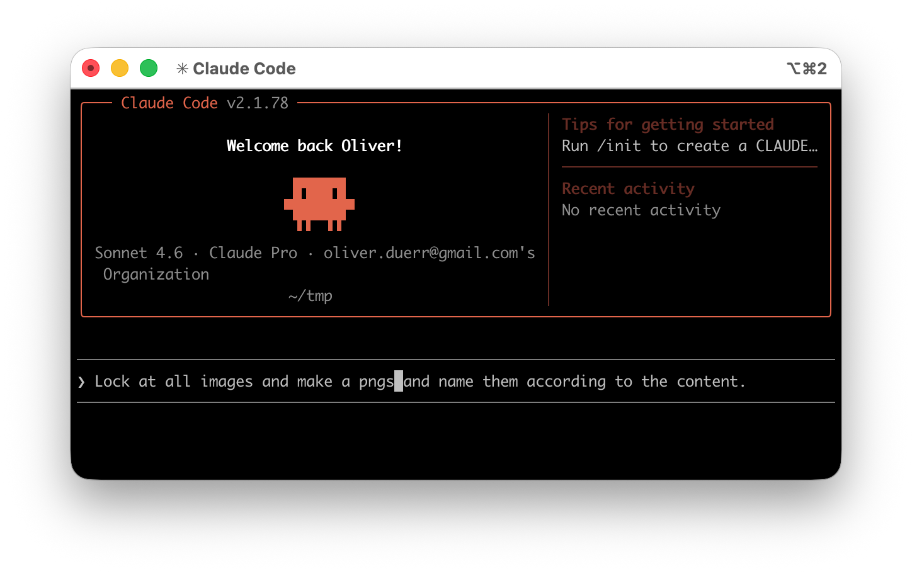
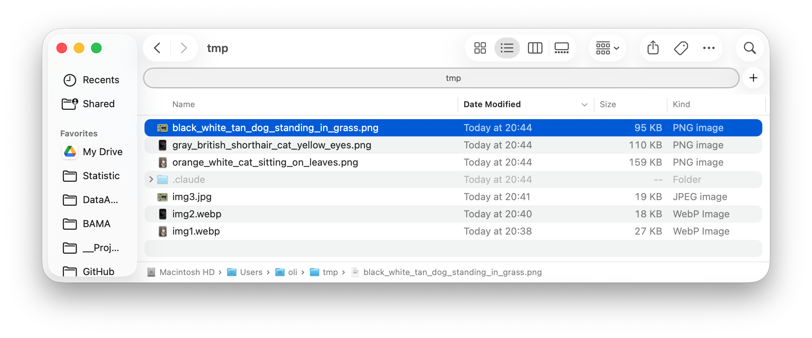
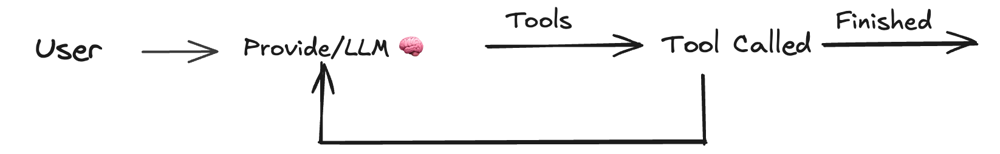
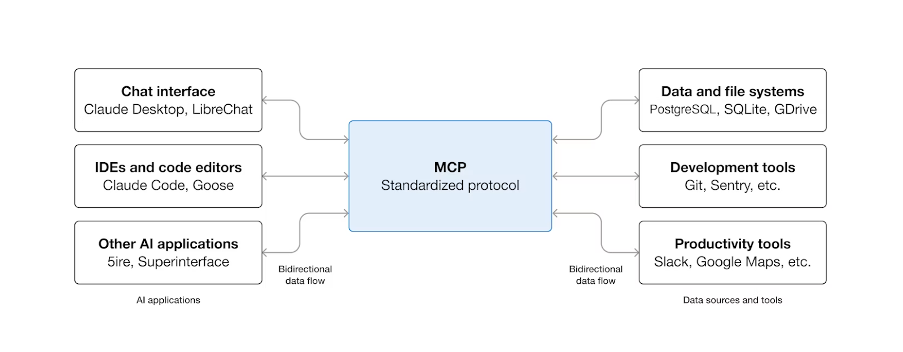
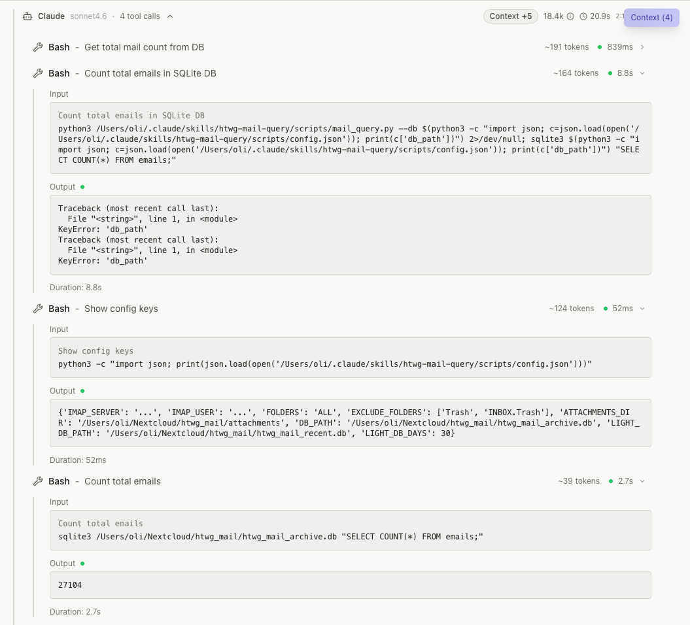

<style>
  section { font-size: 24px; }
  table { font-size: 17px; margin: auto; }
  h1 { color: #2d5986; }
  .cover h1 { font-size: 48px; color: #1a3a5c; }
  .cover { text-align: center; }
  blockquote { border-left: 4px solid #2d5986; padding-left: 1em; color: #555; }
</style>


# CLI Agents, Skills & the Return of the Shell
**Oliver Dürr**
<!-- HTWG Konstanz / TIDIT.ch -->

---

# Talk Overview

1. **Modes of Interaction** — from chat to agentic CLI
   - Level 1: Chat interfaces
   - Level 2: AI coding IDEs & CLIs
   - Level 3: Hosted agents
2. **How it works** — tool calling, and the agentic loop
3. **Skills** — reusable, on-demand workflows
4. **Live demos** — easy_chef, email_router, htwg-mail
5. **Exercise** — verify a causal claim with a CLI agent

---
layout: center
---

# Skills and the CLI Renaissance

| Date | Event | Why it matters |
|------|-------|----------------|
| Feb 2025 | **Claude Code** | Terminal agent becomes mainstream [^1] |
| May 2025 | **Codex** | OpenAI joins the terminal-agent race [^2] |
| Jun 2025 | **Gemini CLI** | Google brings an open-source terminal agent [^3] |
| Oct 2025 | **Anthropic Skills** | Reusable, on-demand workflows [^4] |

**2026 Skills now everywhere Codex, Gemini, OpenClaw, Cursor IDE, and VS Code** [^5][^6][^7] |

> **Takeaway:**  
> The CLI renaissance started in 2025. Skills started in Oktober 2025 now March 2026 they are everywhere.  


<div style="font-size: 10px; margin-top: 1.2em; opacity: 0.8;">
[^1]: Anthropic announcement, “Claude 3.7 Sonnet and Claude Code” (Feb 24, 2025) — https://www.anthropic.com/news/claude-3-7-sonnet  
[^2]: OpenAI announcement, “Introducing Codex” (May 16, 2025) — https://openai.com/index/introducing-codex/  
[^3]: Google announcement, “Gemini CLI: your open-source AI agent” (Jun 25, 2025) — https://blog.google/innovation-and-ai/technology/developers-tools/introducing-gemini-cli-open-source-ai-agent/  
[^4]: Anthropic announcement, “Introducing Agent Skills” (Oct 16, 2025) — https://claude.com/blog/skills  
[^5]: OpenAI Codex Agent Skills — https://developers.openai.com/codex/skills/  
[^6]: Gemini CLI Agent Skills — https://geminicli.com/docs/cli/skills/  
[^7]: OpenClaw Skills — https://docs.openclaw.ai/tools/skills  
</div>
---

# Resources
- https://code.claude.com/docs/en/overview Claud Code Docs (You can chat with it)
- https://github.com/mgechev/skills-best-practices
- https://claude.com/blog/skills-explained (Blog Post introducing Skills)
- https://platform.claude.com/docs/en/agents-and-tools/agent-skills/overview

---
layout: cover
---

# Modes of Interaction with AI

---

# Level 1 — Chat Interfaces: Just Talk

| Platform | Provider | Released | Notes |
|----------|----------|----------|-------|
| ChatGPT | OpenAI | Nov 2022 | First mainstream LLM chat |
| Bard / Gemini | Google | Mar 2023 / Feb 2024 | Rebranded to Gemini |
| Claude | Anthropic | Mar 2023 |  |
| Open WebUI | Community | 2023 | Self-hosted, Ollama backend |


- In original form: just conversation
- Tool calls: user &rarr; LLM &rarr; copy to tool &rarr; paste result &rarr; LLM
- Preferences live in the prompt (system prompt, custom instructions)

---

# Level 2 — AI Coding IDEs: 
### Do When You Trigger Them



---

# Level 2 — AI Coding IDEs (cont.)

| Tool | Type | Released | Open Source |
|------|------|----------|:-----------:|
| GitHub Copilot | VS IDE Plugin | Jun 2022 | No |
| Roo Code | VS Code Plugin | 2024 | Yes |
| Cursor | AI IDE (VS Code Fork) | Mar 2023 | No |
| Windsurf (Codeium) | AI IDE (VS Code Fork) | Nov 2024 | No |
| Antigravity | AI IDE (VS Code Fork) | 2025 | No |

- **Tools**: predefined tool set, MCP servers
- **Preferences**: `AGENTS.md`, rules files, custom instructions
- Tightly integrated in IDE, typically built for coding

> **Question:** Do we even need a traditional IDE in the future?
> Cursor is becoming more like a tool to orchestrate agents.

---

# Level 2 — Command Line Interfaces (CLI)
### Interact with AI in Shell 
```text
claude
```



<!-- As Kadir said, the AI understands me -->

---

# Level 2 — Command Line Interfaces (CLI)

**Predecessors:** GitHub CLI (2023, very limited), Aider & openCode (2024)

### 2025 — The CLI Kick-Off

| CLI | Provider | Released |
|-----|----------|----------|
| **Claude Code** | Anthropic | Feb 2025 |
| **Codex CLI** | OpenAI | May 2025 |
| **Gemini CLI** | Google | Jun 2025 |


- **Tools**: terminal commands (naturally!), MCP servers, **skills**
- **Extensions**: browser automation, system-level actions on your behalf
- CLIs feel more natural for **non-coding tasks** (can still do coding too)
- CLIs seem to be the LLM providers' answer to Cursor & GitHub Copilot

--- 

#  Working in a directory

- Designed for for code (a directory with files), but also works for other tasks
- Files in directory naturally provide the context. Reading and writing is permitted in the directory. 
- You can add addition directories with `claude --add-dir /path/to/dir` or with `/AddDir /path/to/dir` inside the conversation
- `Create pngs for all images in the directory and name them accoring to their content.` 



<!-- Beispiel könnte man all Fakultäsratsbeschlüsse in einem Verzeichnis speichern und dann den LLM fragen -->

---
layout: image-right
image: https://upload.wikimedia.org/wikipedia/commons/9/99/DEC_VT100_terminal.jpg
---

#  The Power of the Shell

The shell — since the 1970s.
Works on Linux, macOS, Windows (PowerShell).

- **The CLI is itself a command** — it can be called by other commands
- The CLI can be part of a **Unix pipeline**
- Nothing stops you from using the CLI to call other CLIs

> We'll come back to this with demos later.

---
layout: image-right
image: ./imgs/openClaw.png
backgroundSize: 31em 100%
---
# Level 3 — Hosted Agents


Agents waiting to be triggered by external events.

- **n8n** — workflow / event automation with agent features
- ...
- **openClaw** 🦞

#### Trigger Sources

- Incoming E-Mail, Slack, Telegram, webhooks, etc.
- Scheduled tasks, e.g. every day at 8:00 AM
- Git events (PR opened, issue created, ...)
- Can also use skills

---
layout: cover
---

# Tool Calling & Preferences

---

# The Agentic Loop

This usually happens in a loop (aka Reason Act Loop, ReAct) 

1. The system (“You are XXX a helpful assistant…”) and the user prompt (“Please add ...”) are sent to LLM.  
2. The LLM returns the response (usually request to use a tool).  
3. The system fulfills the request (e.g. calls a **tool**) and sends the result back to the LLM.

Step 2 and 3 are iterated until success (the ReAct loop ends).




> We will now implement a simple ReAct loop 'manually' ...

---

# Demo Time: Manual ReAct Loop Implementation

Let's take the magic out of the black box and implement a simple ReAct loop ourselves.

> Step throught `tool_usage.py` in https://github.com/oduerr/llm_playground/tree/main/tools_usage


The Code implements a simple ReAct loop, where the LLM can call a tool (add) to solve the following simple math problem:

Task = "Tim has 5652 apples and Jane has 10272727 apples, how many apples do they have together?"

model = `qwen2.5:7b-instruct` ✅

model = `qwen2.5:3b-instruct` ⛔️  

The smaller model only manages "What is 5652 + 10272727?"

---
layout: two-cols-header
---

# Backup for Demo: The Tool we Announce to the LLM

::left::

**① Define the tool**

```python
tools = [
    {
        "type": "function",
        "function": {
            "name": "add",
            "description": "Add two numbers",
            "parameters": {
                "type": "object",
                "properties": {
                    "a": {"type": "number"},
                    "b": {"type": "number"}
                },
                "required": ["a", "b"]
            }
        }
    }
]
```

::right::

**② Call the API with the tool**

```python


TASK = ("Tim has 5652 apples and Jane has "
        "10272727 apples, how many do they "
        "have together?")

# Just a single user message, no system prompt
messages = [{"role": "user", "content": TASK}]

response = client.chat.completions.create(
    model = "qwen2.5:7b-instruct",
    messages = messages,
    tools = tools
)
```

<style>
.two-cols-header {
  column-gap: 20px; /* Adjust the gap size as needed */
}
</style>

---

# Backup for Demo (Step 1) Prompt send to model

```text {lines:true}
========== STEP 1 ==========
=== PROMPT GOING INTO MODEL ===
<|im_start|>system
You are Qwen, created by Alibaba Cloud. You are a helpful assistant.

# Tools

You may call one or more functions to assist with the user query.

You are provided with function signatures within <tools></tools> XML tags:
<tools> 
{"type": "function", "function": {"name": "add", "description": "Add two numbers", "parameters": {"type": "object", "properties": {"a": {"type": "number"}, "b": {"type": "number"}}, "required": ["a", "b"]}}}
</tools>

For each function call, return a json object with function name and arguments within <tool_call></tool_call> XML tags:
<tool_call>
{"name": &lt;function-name&gt;, "arguments": &lt;args-json-object&gt;}
</tool_call><|im_end|>
<|im_start|>user
Tim has 5652 apples and Jane has 10272727 apples, how many apples do they have together?<|im_end|>
<|im_start|>assistant
```

- **Output from the model:** [Requesting tool call]    add({'a': 5652, 'b': 10272727})
- Agent runtime executes the tool call and calculates the result: [Result of tool call]    5652 + 10272727 = 10278379

<!-- Sometimes Agent Runtime is also called agent harness. Note tool definition at line 12 and the last line where agent takes over. A simple system prompt is added by the model -->

---

# Backup for Demo (Step 2)
```
========== STEP 2 ==========
=== PROMPT GOING INTO MODEL ===
<|im_start|>system
You are Qwen, created by Alibaba Cloud. You are a helpful assistant.

... 

<|im_start|>user
Tim has 5652 apples and Jane has 10272727 apples, how many apples do they have together?<|im_end|>
<|im_start|>assistant
<tool_call>
{"name": "add", "arguments": "{\"a\":5652,\"b\":10272727}"}
</tool_call><|im_end|>
<|im_start|>user
<tool_call>
10278379
</tool_response><|im_end|>
<|im_start|>assistant
```

### Output from the model:
[ANSWER] Tim and Jane have a total of 10,278,379 apples together.

<!-- Now the LLM takes over again and this time did not call a loop but provide the answer in one sentence -->

---

# Berkeley's Gorilla LLM Leaderboard

```
qwen
```
Website https://gorilla.cs.berkeley.edu/leaderboard.html


---

# Predefined Tools (in the Prompt)

- The simplest way is to define a fixed set of tools directly in the prompt
- IDE integrations started with this approach
- A set of predefined tools, registered completely in the **initial prompt**
    - Example: Roo Code uses ~50K tokens just for tool definitions
    -   Repeated tool calling and parsing output (ReAct loop)

> **Problem**: fixed toolset, large prompt overhead — every model call pays for the full tool schema.

---

# MCP Servers



- MCP servers expose **tools**, **resources**, and **prompts** to the LLM
- Adopted by Claude Code, Cursor, Windsurf, and others
- Decouples tool implementation from the LLM client
- Token efficient: only relevant parts loaded into context

Taken from https://claude.com/blog/skills-explained
---

# Skills

- Introduced October 2025 with **Claude Code**
    - Now included in other CLIs (gemini, codex)
    - Also in openClaw 🦞 (2026) 
    - And (very recently) in Cursor and the GitHub Plugin to VS Code
- A way to extend CLI capabilities and adapt them to your needs
- Simple **Markdown files** 
    - Describe desired behaviour
- **Markdown files** can also describe how to call 
    - CLI tools including Python, Bash, etc.
    - Other Skills
    - MCP Servers
- Token efficient via **progressive disclosure** — only loaded when needed


---

# Skills vs MCP Servers and other stuff

from: https://claude.com/blog/skills-explained

| Feature | **Skills** | MCP | Subagents |
|---|---|---|---|
| What it provides | Procedural knowledge | Tool connectivity | Task delegation |
| Contains | Instructions + code + assets | Tool definitions | Full agent logic |
| When it loads | Dynamically, as needed | Always available | When invoked |
| Can include code | Yes | Yes | Yes |
| Best for | Specialized expertise | Data access | Specialized tasks |

---

# Skills — Typical Structure

```markdown
pdf-skill/
├── SKILL.md          ← main instructions (always loaded)
├── FORMS.md          ← form-filling guide (loaded on demand)
├── REFERENCE.md      ← detailed API reference (loaded on demand)
└── scripts/
    └── fill_form.py  ← utility script called by the skill
```

Saving Context with **Progressive disclosure**: 
- Level 1: Header of `SKILL.md` used to register the skill.
- Level 2: Read `SKILL.md` itself, which could also reference other files.
- Level 3: Other files like `FORMS.md` and `REFERENCE.md` are loaded on demand.
---
layout: cover
---

# Demo Time

---

# Demo: easy_chef

Translates a recipe into my preferred format with mise en place and ingredient lists.

- The skill is public: [github.com/oduerr/skills_public/.../easy_chef](https://github.com/oduerr/skills_public/tree/main/skills/easy_chef)
- No scripts needed just uses just begining (YAML-Header) is to reqister `SKILL.md`:

```markdown
---
name: easy_chef
description: "Use whenever the user shares a recipe or asks to simplify, reformat, or explain a dish ..."
---

# Easy Chef
Transform any recipe into a structured, easy-to-follow format with cross-referenced ingredients and culinary critique.
...
```

Inside CLI (claude, gemini) 
```
Give me a recipe of new york cheesecake.
```
Will triger the skill and render e mises en-place recipie

---

# Demo: email_router

- [github.com/oduerr/skills_private/.../email_router](https://github.com/oduerr/skills_private/tree/main/skills/email-router)

```
email-router/
├── SKILL.md            ← main instructions (always loaded)
├── maba.md             ← specialization for "MABA" use-case (loaded on demand)
├── praktikantenamt.md  ← specialization for the internship office (loaded on demand)
```
From SKILL.md
```markdown
# Email-Router

Du bist Oliver Dürrs persönlicher E-Mail-Assistent. Deine Aufgabe ist es, eingehende E-Mails zu klassifizieren und passende, fertig kopierbare Antworten auf Deutsch zu generieren.

## Schritt 1: Klassifikation

Lies die E-Mail und bestimme die Kategorie:

| Kategorie | Schlüsselbegriffe / Kontext |
|---|---|
| `praktikantenamt` | Praktikum, Praxissemester, PPS, Praktikantenstelle, Pflichtpraktikum, Anrechnung Praktikum |
| `maba` | Bachelorarbeit, Masterarbeit, BA, MA, Abschlussarbeit, Thesis, Betreuung, Themenvorschlag |
```
<!-- Live demo -->

---

# Demo: htwg-mail

Queries a file-based SQLite database of my HTWG mails, operating a Python script.

- Private repo: [github.com/oduerr/skills_private/.../htwg-mail](https://github.com/oduerr/skills_private/skills/htwg-mail)
- Uses `SKILL.md` + a Python script (SQLite query to access db)

**Sample prompts:**
```
Welche Mails habe ich am Schmotzigen Dunstig 2024 bekommen?
```

```
Wieviele Mails sind in der Datenbank?
```

```
which tools did you use with which calls?
```

<!--
Oh Wieviele Mails sind in der Datenbank? Geht ja gar nicht mit dem python script.
-->

---

# htwg-mail — The Surprise

Those clever bastards didn't use the Python script directly — they ran a raw **SQLite query**.

> Super-human performance (at least compared to me).

The LLM figured out the database schema on its own and wrote optimized SQL — bypassing the intended Python wrapper entirely.

Let's look at the output using `claude-devtools`:

---
layout: center
---



---

# A Skill Can Spawn Other CLIs

### Demo: Council of Bots

- A task you want to ask **Gemini, Claude, and OpenAI** simultaneously
- Start 3 CLIs in parallel and collect answers from each
- Merge and consolidate the answers

This is implemented as a skill that spawns 3 CLIs and merges responses.

See: [github.com/slds-lmu/ai-scaffolding/.../council-of-bots](https://github.com/slds-lmu/ai-scaffolding/tree/main/skills/council-of-bots)

---
layout: image-right
image: https://upload.wikimedia.org/wikipedia/commons/9/99/DEC_VT100_terminal.jpg
---
# The Power of the Shell (In the 80s)

```bash
echo "Hello, World" | wc -c
```
**Output**: `13`

```bash
echo "Hello, World" | awk '{print $2}' | wc -c
```
**Output**: `6`

```bash
wc < file.txt
```

.
.


>Small programs, which can do one thing very good are piped together.

<!--
Speaker notes:
wc -c counts the number of characters in the input.
For tokens, one could use ttok.
-->

---

# The power of the Shell in 2026

### Example 1
```bash
echo "What is 'Hello Guys' in Chinese and Italian" | gemini
```

**Output**: In Chinese: **大家好** (Dàjiā hǎo) In Italian: **Ciao ragazzi**

### Example 2

Pipe text directly into an LLM — just like any other Unix tool.

```bash
gemini -p "Is this a good recipe?" < schwaebischer_kartoffelsalat.md 
  | claude -p "Übersetze ins Deutsche"
```

**Output**:
```
Dies ist ein ausgezeichnetes, technisch durchdachtes Rezept für einen
traditionellen schwäbischen Kartoffelsalat. Sein Erfolg liegt in
mehreren entscheidenden kulinarischen "Profi-Kniffen":

*  Thermische Absorption: Die Zwiebeln in heißer Brühe…
*  Die Ölbarriere: Das Öl zuletzt hinzuzufügen…
*  Zwiebelbehandlung: Das Blanchieren der Zwiebeln…
```

Two models, one pipeline. Gemini evaluates, Claude translates.

---

# The power of the Shell: Many Tools go CLI

**Many modern tools expose a command line interface**

- **Web browsers** — Puppeteer, Playwright  
- **Platforms** — GitHub CLI (`gh`), GitLab CLI  
- **Cloud** — AWS CLI, Google Cloud CLI  
- **PIM** - Obsidean CLI

**Agents can operate these tools via the shell**

```markdown
Agent  →  Skill (optional)  →  CLI tool  →  Result
```

- **CLI tools** = capabilities  
- **Skills** = reusable workflows  
- **Agent** = decides what to run

---

## Practical Tips

- Skills are just Markdown files and easy to create.
- Talk to the Claude (ChatApplication) and ask it to create the skill for you. It will eat his own dogfood and use the skill creator skill.
- Skill are compatible with all CLIs (Claude Code, Gemini CLI, ...) and also run on openClaw 🦞
- 
- Use `claude-devtools` to inspect the output of the claude code.


---
layout: cover
---

# Exercise

---

# Exercise: Verify a Causal Claim with a CLI Agent

The file `causal_data.csv` contains three variables: A, B, and C.
Someone claims that **B is a cause of C**.

The data is available at:
```
https://raw.githubusercontent.com/oduerr/llm_playground/refs/heads/main/cli/causal_data.csv
```

Write a prompt for a CLI agent (Claude Code, Gemini CLI, etc.) that downloads
the data and evaluates whether the claim is justified.

---

# Exercise Solution 

```text 
You are an expert in statistics and causal inference.
You will a datafile with three variables: A, B, and C. Your task is to reason carefully about causality — not just correlation. 
Think step by step. Consider alternative causal explanations before concluding. Look at the provided data.

Name of the data file: causal_data.csv
Claim C is causaliy realated to B.

The data is available at: https://raw.githubusercontent.com/oduerr/llm_playground/refs/heads/main/cli/causal_data.csv

Please first download the data and then reason about the claim. 
Finally, provide a conclusion on whether the data supports the claim or not.

```

---

# Result

```markdown
 Step 4 — Causal Structure Inference

  The data pattern is the textbook signature of a fork (common cause) structure:

  B ← A → C

  - A causes B (with coefficient ≈ 2)
  - A causes C (with coefficient ≈ 3)
  - B and C are spuriously correlated through A
  - B and C have no direct causal link in either direction

  Alternative structures ruled out:
  - A → B → C: would require corr(B,C|A) > 0 (it is ~0)
  - C → B (direct): would require C to explain B residuals after A (it does not; coefficient = −0.02)
  - B → C (direct): same argument — B has zero partial effect on C

  ---
  Conclusion

  The data does NOT support the claim that C is causally related to B.

  The strong observed correlation between B and C is entirely a confounding artifact driven by A, which is a common cause of both. Conditioning on A
  renders B and C independent (partial correlation ≈ 0.00). There is no evidence of any direct causal pathway between C and B in either direction.
```

---
layout: two-cols-header
---

# Food for thought: an MD File doing Research

If time permits, we can also look at Andrej Karpathy's `autoresearch` project, which is an MD file that implements a full research workflow.

::left::
- [https://github.com/karpathy/autoresearch](https://github.com/karpathy/autoresearch)
- Simply spin up your Claude/Codex or whatever you want in this repo (and disable all permissions), then you can prompt something like:
```text
Hi have a look at program.md and let's kick off a new experiment! let's do the setup first.
```

The program.md file is essentially a super lightweight "skill". The agent modifies the python code in 'train.py' to run an experiment (including commiting the code changes to git)


::right::


--- 

# Technical Things

- Cheat Sheet for skills: https://github.com/Njengah/claude-code-cheat-sheet 
- Of special interest: 
    - `claude --resume` reloads a previous conversation (you can give a name to the conversion by chatting)
    -   


---
layout: cover
---

# Thank You

**Oliver Dürr** 

---
layout: cover
---

# Attick

---

# Sometime even w/o skills

Animation 


---

## Tracing

Observability for CLI agents — seeing what the LLM actually does.

- **Claude Code**: see [Simon Willison's writeup](https://simonwillison.net/2025/Jun/2/claude-trace/)
  Unfortunately broken in newer Claude versions.
- **Gemini CLI**: [telemetry docs](https://google-gemini.github.io/gemini-cli/docs/cli/telemetry.html)
  JSON dump available, but not very readable.

> **Future direction**: OpenTelemetry integration + dedicated visualizers
> would make agent tracing much more usable.

---

# LLMs — The Workhorses (API Models)

| Model | Provider | Input $/M | Cached $/M | Output $/M | SWE-bench |
|-------|----------|----------:|-----------:|-----------:|----------:|
| **Claude Opus 4.5** | Anthropic | $5.00 | $0.50 | $25.00 | **80.9%** |
| **Gemini 3.1 Pro** | Google | $2.00 | ~$0.20 | $12.00 | 80.6% |
| **GPT-5.2** | OpenAI | $1.75 | — | $14.00 | 80.0% |


- **Open Source models**

    Qwen 3.5-122B (MoE) | 122B | 10B | DGX Spark (128G)

SWE-bench Verified (500 human-validated problems). Prices as of Mar 2026.
Sources: [OpenAI](https://openai.com/api/pricing/) · [Anthropic](https://platform.claude.com/docs/en/about-claude/pricing) · [Google](https://ai.google.dev/gemini-api/docs/pricing) · [SWE-bench](https://www.swebench.com)

---

# LLMs — Open Source / Self-Hosted

| Model | Total Params | Active Params | Suitable Hardware |
|-------|------------:|-------------:|-------------------|
| DeepSeek R1 14B | 14B | 14B | Laptop (16 GB) |
| Qwen 3.5-35B (MoE) | 35B | 3B | Laptop (16 GB), Mac Mini 32G |
| DeepSeek R1 32B | 32B | 32B | Mac Mini 32G |
| Llama 3.3 70B | 70B | 70B | DGX Spark (128G) |
| Qwen 3.5-122B (MoE) | 122B | 10B | DGX Spark (128G) |

- **MoE** = Mixture of Experts — only a fraction of parameters active per token
- **NVIDIA DGX Spark**: 128 GB unified memory, Grace Blackwell chip
- Inference via **Ollama**, **llama.cpp**, or **vLLM** (GGUF quantized)
- Self-hosted: data stays local, ~20 ms latency on LAN vs 250–800 ms cloud

--- 
layout: cover
---

## Manuel Implementation of an Simple Agent (If Time Permits)

---

## Manuel Implementation of an Agent (Showing the ReAct Loop)

The idea is to create a simple agent in python that implements the ReAct loop, implementing the email-router skill.

**Prompt** given to Claude Code:
> Create a Python file (email-agent.py) that uses the OpenAI-compatible API (configured for openAI) to call LLMs and execute tools. The agent loads ~/.claude/skills/email-router/SKILL.md as system prompt and has a single tool read_context(filename) that reads .md files from the same skill directory. The ReAct loop runs until no more tool calls are made.

Full created code (minimal manuel tweeks needed) ~150 lines of code.
https://github.com/oduerr/skills_private/blob/main/mini-agents/email-agent.py

---

## Key components: definition of a (virtual) tool for the LLM

```python
TOOLS = [
    {
        "type": "function",
        "function": {
            "name": "read_context",
            "description": (
                "Read a context file from the email-router skill directory. "
                "Use this to load additional context before generating a reply. "
                "Available files: praktikantenamt.md, maba.md"
            ),
            "parameters": {
                "type": "object",
                "properties": {
                    "filename": {
                        "type": "string",
                        "description": "Filename to read, e.g. 'praktikantenamt.md'"
                    }
                },
                "required": ["filename"]
            }
        }
    }
]
```

---

## Key components (Prepare the prompt)

Composing the first message, we use the same 'SKILL.md', we used for the 'email_router' file as the system prompt.
```python
# System-Prompt = SKILL.md 
skill_md = SKILL_MD.read_text() # "Du bist Oliver Dürrs persönlicher E-Mail-Assistent. "
history = [{"role": "system", "content": skill_md}]

mail_text = "Sehr geehrter Herr Dürr, 
 Hiermit bitte ich Sie, nachfolgend meines..."
user_message = f"Beantworte diese Mail:

{mail_text}"
history.append({"role": "user", "content": user_message})
```


---

## Key components (ReAct loop)

```python
while True:
        response = CLIENT.chat.completions.create(
          model=MODEL,
          messages=history,
          tools=TOOLS, # read_context
          tool_choice="auto" # auto-select tool or answer
        )

        message = response.choices[0].message # Returned by the LLM
        history.append(message)

        # No Tool-Call → done, final answer
        if not message.tool_calls:
            return message.content, history

        # Execute requested Tool-Call
        for tool_call in message.tool_calls:
            if tool_call.function.name == "read_context":
                filename = json.loads(tool_call.function.arguments)["filename"]
                result = read_context(filename)

                history.append({
                    "role": "tool",
                    "tool_call_id": tool_call.id,
                    "content": result
                })
```
